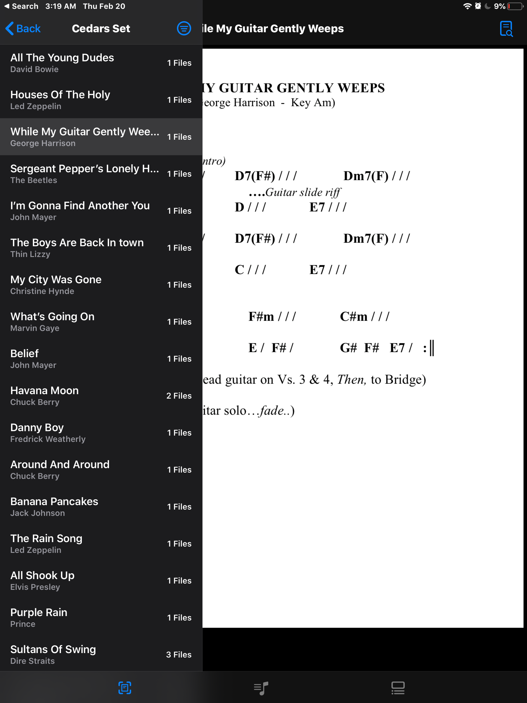

# SetMate
SetMate was developed for performing musicians. The app was inspired by Marlon's (SetMate Developer) dad who performs regularly and needs to keep track of different sets and song lists. The only software available to him before SetMate is either too cluttered, hard to navigate, and most importantly, doesn't offer flexible editing. So, we developed SetMate for Build Week at Lambda School. We had a 1 week deadline.

### Technologies Used:
- UIKit
- CoreData
- PDFKit
- Swift
- MobileCoreServices

### Developers
* Marlon Raskin     [GitHub Profile](https://github.com/marlonjames71)
* Jeffrey Santana   [GitHub Profile](https://github.com/Santana-Says)

 
 

